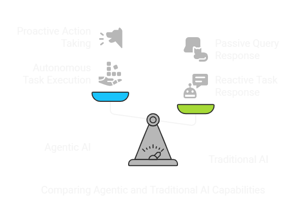
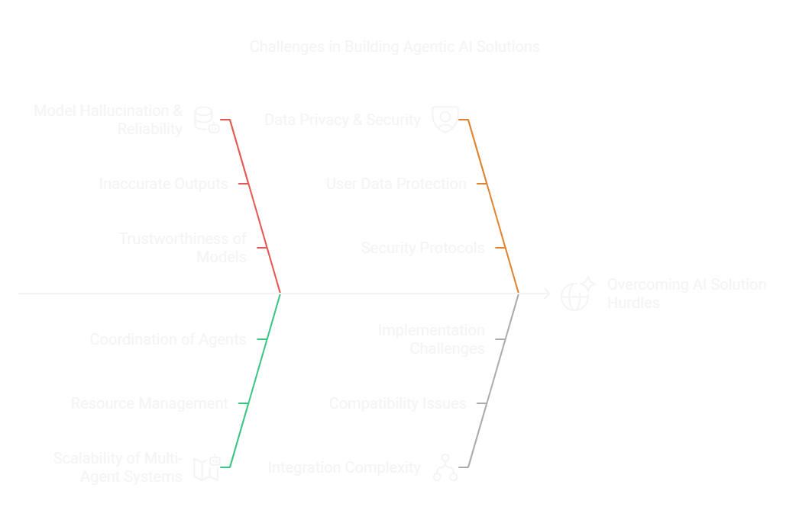
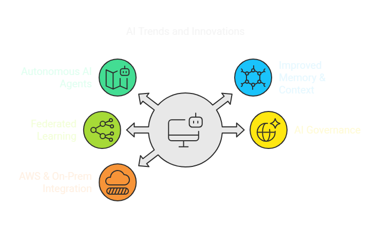

# 🚀 Build Agentic AI Solutions Using Amazon Bedrock

## 🌟 Overview
This guide provides a **step-by-step approach** to building **Agentic AI solutions** using **Amazon Bedrock**. It covers **foundational concepts, core components, hands-on implementation, challenges, and future trends**.

## 📜 Table of Contents
1. 📌 [Introduction to Agentic AI](./docs/01_introduction.md)
2. 🔍 [Understanding Amazon Bedrock](./docs/02_amazon_bedrock.md)
3. 🏗️ [Core Components of Agentic AI](./docs/03_core_components.md)
4. ⚙️ [Building an Agentic AI Solution](./docs/04_building_solution.md)
5. 🚨 [Challenges in Building Agentic AI Solutions](./docs/05_challenges.md)
6. 🔮 [Future Directions in Agentic AI](./docs/06_future_directions.md)

---

## 1️⃣ Introduction to Agentic AI
🔗 [Read more](./docs/01_introduction.md)

### 🤔 What is Agentic AI?
- AI systems that can autonomously **plan, reason, and execute** tasks.
- Unlike traditional AI, agentic AI can **proactively take actions** instead of just responding to queries.

### 🛠️ Why Use Amazon Bedrock for Agentic AI?
- ✅ **Fully managed foundation models (FMs).**
- 🔒 **Scalable and secure** for enterprise AI solutions.
- 🔗 **Seamless AWS integration** (Lambda, S3, DynamoDB, etc.).

---

## 2️⃣ Understanding Amazon Bedrock
🔗 [Read more](./docs/02_amazon_bedrock.md)

### 🏗️ Overview
- 🧠 **Pre-trained foundation models** (Claude, Jurassic-2, Titan, etc.).
- ⚡ **API-based inference** without managing infrastructure.

### 🔑 Key Features
- 🚀 **Serverless deployment** with AWS services.
- 🎯 **Fine-tuning & RAG (Retrieval-Augmented Generation).**
- 🔗 **Tight integration** with AWS services.

---

## 3️⃣ Core Components of Agentic AI
🔗 [Read more](./docs/03_core_components.md)

### 🏛️ Foundation Models (FMs)
- 🏆 **Amazon Titan** (Developed by AWS)
- 🤖 **Anthropic Claude** (Optimized for reasoning and chat)
- 📝 **AI21 Labs Jurassic-2** (Best for long-form text generation)
- 🎨 **Stable Diffusion** (Image generation)

### 🔄 Orchestration & Planning
- 🤝 **Multi-Agent Collaboration**
- 📊 **Task Decomposition & Execution**
- 🧠 **Memory & Context Awareness**

### 🔍 Data & Knowledge Integration
- 📚 **Retrieval-Augmented Generation (RAG)**
- 🔧 **Fine-Tuning Customization**
- 🗄️ **Vector Databases for AI Memory** (Amazon OpenSearch, Pinecone, etc.)

### ⚙️ API & Automation
- 🏗️ **AWS Lambda for Task Execution**
- 🔄 **Amazon Step Functions for Workflow Orchestration**
- 📡 **Event-Driven AI Pipelines**

---

## 4️⃣ Building an Agentic AI Solution Using Amazon Bedrock
🔗 [Read more](./docs/04_building_solution.md)

### 🛠️ Step-by-Step Guide
1. **🎯 Problem Definition & Use Case Selection**
   - 🤖 Automating customer support.
   - 📊 AI-driven data analytics & decision-making.
   - 🔄 Autonomous workflow management.

2. **🧠 Model Selection & Fine-Tuning**
   - 🤔 Choose the right foundation model.
   - 🔧 Fine-tune with domain-specific data.
   - 🎯 Use prompt engineering for optimized outputs.

3. **🔗 Integrating with AWS Services**
   - 🗄️ Store knowledge base in **Amazon S3**.
   - 🔍 Use **Amazon OpenSearch** for vector-based retrieval.
   - 🚀 Deploy agents using **AWS Lambda** & **API Gateway**.

4. **📊 Testing & Performance Optimization**
   - ✅ Evaluate model accuracy.
   - ⚡ Optimize latency using efficient API calls.
   - 📈 Use **AWS CloudWatch** for monitoring.

---

## 5️⃣ Challenges in Building Agentic AI Solutions
🔗 [Read more](./docs/05_challenges.md)

### ⚠️ Key Challenges
- 🌀 **Model Hallucination & Reliability Issues**
- 📡 **Scalability of Multi-Agent Systems**
- 🔒 **Data Privacy & Security in AI Interactions**
- 💰 **Managing Computational Costs on AWS**
- 🔄 **Integration Complexity with Legacy Systems**

---

## 6️⃣ Future Directions in Agentic AI with Amazon Bedrock
🔗 [Read more](./docs/06_future_directions.md)

### 🔮 Trends & Innovations
- 🚀 **Evolution of Autonomous AI Agents**
- 🧠 **Better Memory & Long-Term Context Awareness**
- 🔐 **Federated Learning for Privacy-Preserving AI**
- ⚖️ **AI Governance & Ethical AI Regulations**
- 🏭 **Tighter AWS & On-Prem AI Model Integration**

---

### 🎤 **Connect with Me:**
- 👨‍💻 **LinkedIn**: [Shaishav Surati 🇮🇳](https://www.linkedin.com/in/shaishavsurati)
- 💻 **GitHub**: [shaishav06](https://github.com/yourusername)
- 📧 **Email**: [shaishavsurati06@gmail.com](mailto:shaishavsurati06@gmail.com)

### 🚀 Made with ❤️ by **Shaishav Surati**
