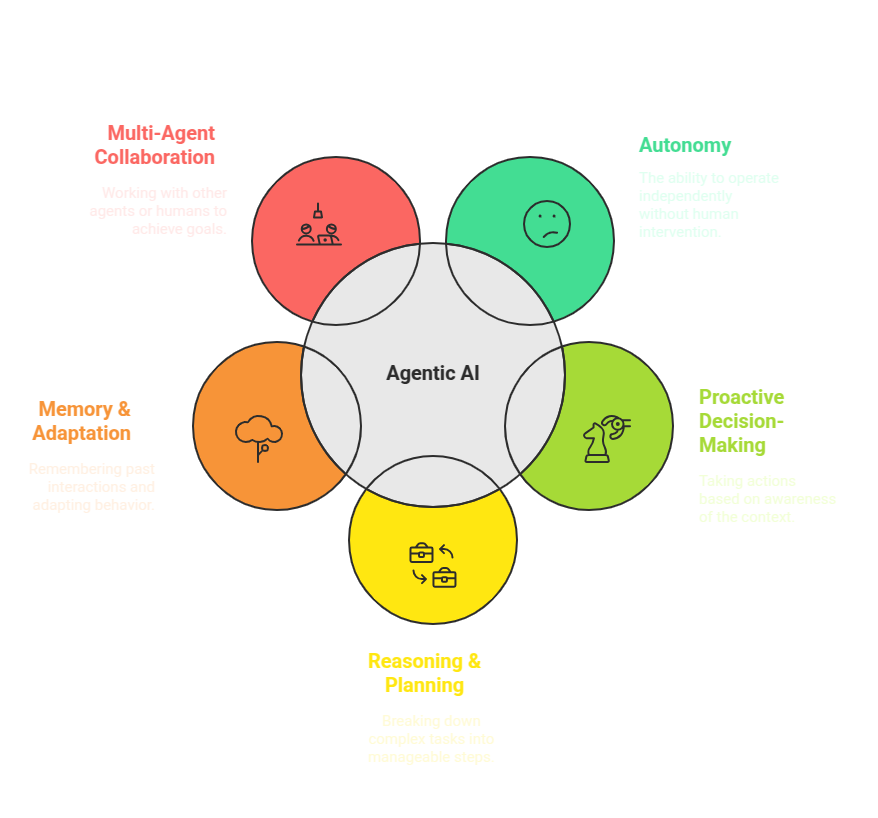

# 🤖 Introduction to Agentic AI

## 🌟 What is Agentic AI?
Agentic AI refers to AI systems that can **autonomously plan, reason, and execute** tasks. Unlike traditional AI models, which are passive and respond only to user inputs, agentic AI takes a **proactive approach**, making decisions based on its environment, goals, and learned knowledge.

### 🔑 Key Characteristics of Agentic AI:
1. 🏗️ **Autonomy:** Can operate without continuous human intervention.
2. 🔍 **Proactive Decision-Making:** Takes actions based on contextual awareness.
3. 🧠 **Reasoning & Planning:** Uses AI reasoning to break down complex tasks into manageable steps.
4. 🔄 **Memory & Adaptation:** Remembers past interactions and adapts behavior over time.
5. 🤝 **Multi-Agent Collaboration:** Can work alongside other AI agents or human users to achieve complex goals.

### 🆚 Example: Traditional AI vs. Agentic AI
| 🔹 Feature            | 🤖 Traditional AI  | 🚀 Agentic AI |
|-------------------|---------------|------------|
| **Response Type** | 🏷️ Reactive (answers queries) | 🔄 Proactive (plans and executes) |
| **Adaptability**  | 📜 Predefined responses | 📈 Learns and adapts over time |
| **Decision-Making** | 🎯 Minimal (based on predefined rules) | 🤔 Autonomous (reasoning-based) |
| **Task Execution** | 🖱️ Requires user input | 🏆 Self-driven actions |

#### 📌 Example Use Case: Agentic AI in Customer Support
- 🗨️ **Traditional AI Chatbot:** Responds to customer questions based on predefined rules.
- 🤖 **Agentic AI Chatbot:** Analyzes the customer's issue, proactively offers solutions, escalates if needed, and follows up later.

---

## ⚡ Why Use Amazon Bedrock for Agentic AI?
Amazon Bedrock provides a **fully managed service** for building AI-powered applications with **foundation models (FMs)**. It simplifies the deployment of **Agentic AI** solutions by offering scalability, security, and seamless AWS service integration.

### 🚀 Key Advantages of Amazon Bedrock:
1. **📚 Fully Managed Foundation Models**
   - ✅ Access to pre-trained models like **Anthropic Claude, Amazon Titan, and AI21 Jurassic-2**.
   - 🔗 No need to manage infrastructure; just use APIs.

2. **📈 Scalable & Secure AI Deployment**
   - ⚡ **Auto-scaling:** Handles increased workloads without manual intervention.
   - 🔐 **Security:** Integrated with AWS IAM, encryption, and monitoring tools.

3. **🔗 Seamless AWS Integration**
   - 🏗️ **AWS Lambda:** Execute AI-powered tasks automatically.
   - 🗄️ **Amazon S3:** Store large datasets for AI training and retrieval.
   - 📊 **Amazon DynamoDB:** Manage structured data for AI interactions.
   - 🔍 **Amazon OpenSearch:** Enhance retrieval-augmented generation (RAG) with vector search.

#### 📌 Example: Using Amazon Bedrock for a Personalized AI Assistant
Imagine a **finance AI assistant** built with Amazon Bedrock:
1. 📂 **Data Storage:** Stores financial documents in **Amazon S3**.
2. 🧠 **AI Model Processing:** Uses **Anthropic Claude** for complex reasoning.
3. ⚙️ **Task Execution:** Triggers **AWS Lambda** functions for automated reporting.
4. 🌍 **User Interaction:** Queries are managed via **API Gateway & Step Functions**.

By leveraging Amazon Bedrock, developers can **focus on building AI-driven applications** rather than worrying about model deployment and infrastructure management.

---
### 🔜 Next Steps:
Proceed to **[Understanding Amazon Bedrock](./02_amazon_bedrock.md)** to learn about its core features and components. 🚀
