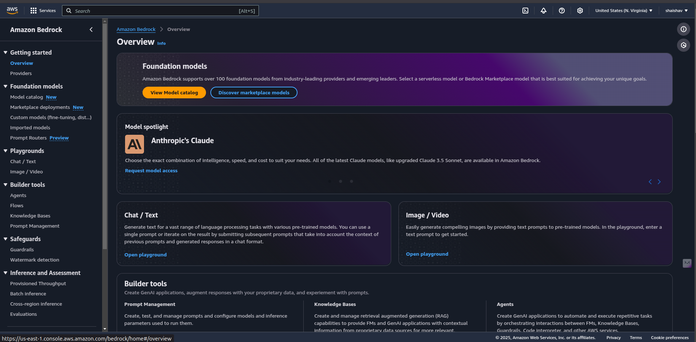

# Understanding Amazon Bedrock

## Overview
Amazon Bedrock is a **fully managed service** that provides access to **pre-trained foundation models (FMs)** from leading AI providers. It enables developers to build and deploy **Agentic AI** applications without managing underlying infrastructure.



### 🔹 Key Foundation Models Available in Amazon Bedrock
Amazon Bedrock provides access to several **pre-trained models**, including:

| Model Name | Provider | Best For |
|------------|-----------|-------------|
| **Amazon Titan** | AWS | General-purpose AI tasks, embeddings, text generation |
| **Claude** | Anthropic | Conversational AI, reasoning, and summarization |
| **Jurassic-2** | AI21 Labs | Long-form text generation, writing assistance |
| **Stable Diffusion** | Stability AI | Image generation and editing |

### 🔹 API-Based Inference
With Amazon Bedrock, developers can interact with foundation models **via APIs**, eliminating the need to provision GPUs or infrastructure.

#### 📌 Example: Calling Amazon Bedrock API with Python (Boto3)
```python
import boto3
import json

# Initialize Bedrock client
client = boto3.client('bedrock-runtime')

# Define input prompt
prompt = "Summarize the latest AI trends in 2024."

# Invoke model (Claude in this case)
response = client.invoke_model(
    modelId='anthropic.claude-v1',
    body=json.dumps({"prompt": prompt, "max_tokens": 200})
)

# Parse and print response
result = json.loads(response['body'].read())
print(result['completion'])
```
🔹 This API call sends a **text prompt** to the Claude model and returns a summarized response.

---

## Key Features

### 1️⃣ **Serverless Deployment**
- Amazon Bedrock abstracts infrastructure management, allowing developers to **focus on AI logic** rather than scaling concerns.
- Automatically scales based on API requests.
- **No need to manage GPUs or clusters**.

#### 📌 Example: Deploying an AI-powered FAQ Bot
1. **Create an API Gateway** to accept user queries.
2. **Use AWS Lambda** to invoke Amazon Bedrock models.
3. **Return AI-generated responses** to the user.

### 2️⃣ **Fine-Tuning & Retrieval-Augmented Generation (RAG)**
- Developers can **fine-tune models** with domain-specific datasets.
- **RAG** enhances AI memory by integrating external data sources (e.g., **Amazon OpenSearch** for vector search).

#### 📌 Example: Fine-Tuning Amazon Titan with Custom Data
1. Prepare **training data** in Amazon S3.
2. Use **AWS SageMaker** to fine-tune the model.
3. Deploy the fine-tuned model via **Amazon Bedrock** for inference.

### 3️⃣ **Seamless AWS Integration**
Amazon Bedrock is deeply integrated with AWS services:
- **Amazon S3** → Store AI training data.
- **AWS Lambda** → Automate AI workflows.
- **Amazon OpenSearch** → Power **Retrieval-Augmented Generation (RAG)**.
- **Amazon DynamoDB** → Store structured AI responses.

#### 📌 Example: AI-Powered Document Search with RAG
1. Upload documents to **Amazon S3**.
2. Extract embeddings using **Amazon Titan**.
3. Store embeddings in **Amazon OpenSearch**.
4. Query OpenSearch to retrieve context and generate responses using Bedrock models.

---
### 🚀 Next Steps:
Proceed to **[Core Components of Agentic AI](./03_core_components.md)** to explore AI orchestration and automation.
