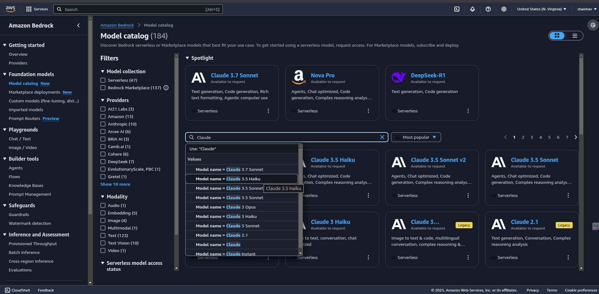
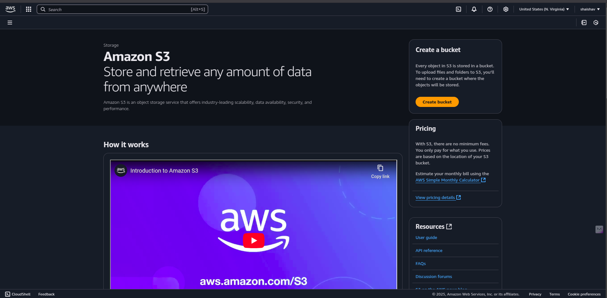
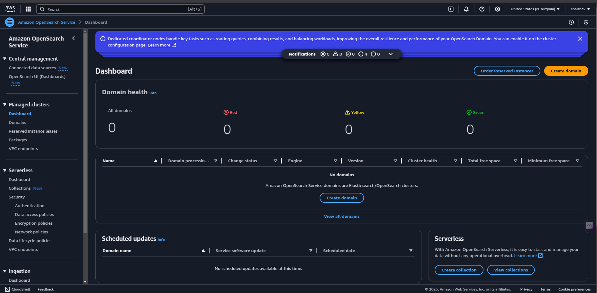
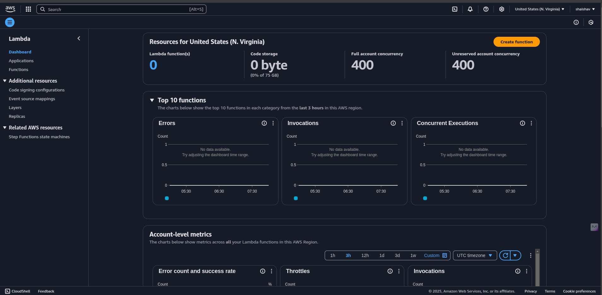
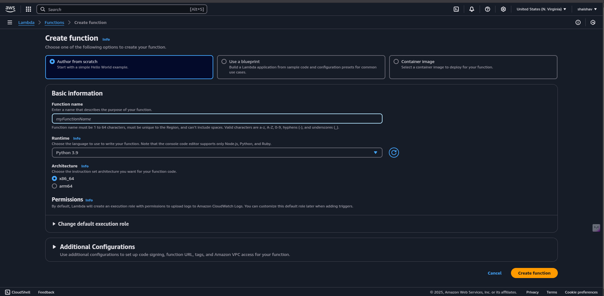
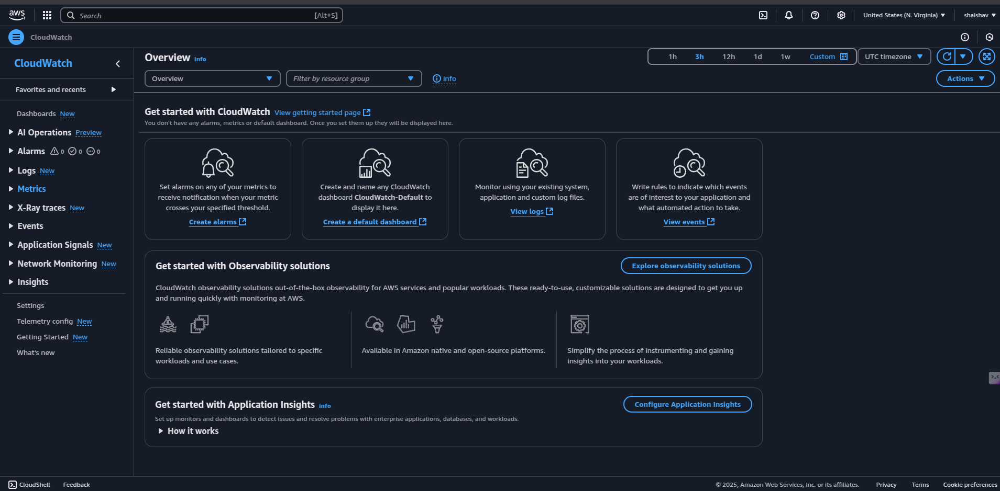
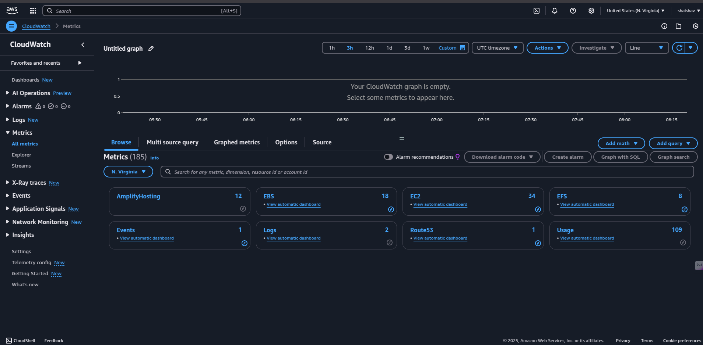

# 🤖 Building an Agentic AI Solution Using Amazon Bedrock

## 🛠️ Step-by-Step Guide
This guide will walk you through **building an Agentic AI solution** using **Amazon Bedrock** with a **hands-on approach in the AWS Dashboard**. 🚀

---

## 1️⃣ Problem Definition & Use Case Selection
Before implementation, define your problem statement. Here are some common **Agentic AI use cases**:

| 🎯 Use Case | 📌 Description |
|------------|-------------|
| 🤖 **Automating Customer Support** | AI chatbots that handle user queries autonomously. |
| 📊 **AI-Driven Data Analytics** | AI agents generate insights and reports from business data. |
| 🔄 **Autonomous Workflow Management** | AI automates repetitive business processes. |

📌 **Example Use Case: AI-Powered Customer Support Chatbot**
- Users ask questions via a web UI.
- The AI agent queries a **knowledge base stored in Amazon S3**.
- The chatbot retrieves the best response using **Amazon OpenSearch**.
- AI-generated responses are delivered via **Amazon API Gateway & Lambda**.

---

## 2️⃣ Model Selection & Fine-Tuning
Amazon Bedrock provides several **foundation models (FMs)**. Select the best model based on your use case.

### 🎯 Choosing a Model
| 🤖 Model | 💡 Best For |
|------------|-------------|
| **Anthropic Claude** | Conversational AI & customer support |
| **Amazon Titan** | General-purpose AI & embeddings |
| **AI21 Jurassic-2** | Long-form text generation |
| **Stable Diffusion** | AI-generated images |

### 🔧 Fine-Tuning the Model
Fine-tune the model using **domain-specific data** stored in **Amazon S3**.

#### 📌 Fine-Tuning Steps in AWS Dashboard 🖥️
1. **Navigate to Amazon Bedrock** → Select **Fine-Tune Model**.
   
2. **Choose a Base Model** (e.g., Amazon Titan or Claude).
   
3. **Upload Fine-Tuning Dataset** to Amazon S3.
4. **Set Hyperparameters** (learning rate, epochs, batch size, etc.).
5. **Start Fine-Tuning** and wait for model training completion.
6. **Deploy the Fine-Tuned Model** via API Gateway.

#### 📌 Example: Fine-Tuning with Boto3 (Python)
```python
import boto3

client = boto3.client("bedrock-runtime")
response = client.invoke_model(
    modelId="anthropic.claude-v1",
    body={"prompt": "Train on dataset X", "max_tokens": 500}
)
print(response["body"].read())
```

---

## 3️⃣ Integrating with AWS Services

### 🗄️ **Step 1: Store Knowledge Base in Amazon S3**
1. **Go to AWS Console → S3 → Create Bucket**.
   
2. **Upload your FAQ or knowledge documents (JSON, CSV, PDF)**.

#### 📌 Example: Upload a File to S3 (Python)
```python
import boto3

s3 = boto3.client('s3')
file_name = "knowledge_base.json"
bucket_name = "ai-knowledge-storage"

s3.upload_file(file_name, bucket_name, file_name)
```

---

### 🔍 **Step 2: Use Amazon OpenSearch for Vector Search**
1. **Go to AWS Console → OpenSearch → Create Cluster**.
   
2. **Enable KNN (K-Nearest Neighbors) for vector search**.
3. **Store document embeddings in OpenSearch**.

#### 📌 Example: Store Embeddings in OpenSearch (Python)
```python
import boto3

opensearch = boto3.client('opensearch')
data = {"text": "What is AI?", "vector": [0.1, 0.2, 0.3]}
response = opensearch.index(
    index='ai_knowledge',
    body=data
)
print(response)
```

---

### ⚡ **Step 3: Deploy AI Agents Using AWS Lambda & API Gateway**
#### 📌 AWS Lambda Deployment Steps
1. **Navigate to AWS Console → Lambda → Create Function**.
   
2. **Choose "Python 3.9" as the runtime**.
   
3. **Add Bedrock API Call Logic**.
4. **Deploy Lambda function** and integrate with API Gateway.

#### 📌 Example: AI Chatbot with Lambda
```python
import json
import boto3

def lambda_handler(event, context):
    client = boto3.client("bedrock-runtime")
    prompt = event["queryStringParameters"]["user_input"]
    
    response = client.invoke_model(
        modelId="anthropic.claude-v1",
        body=json.dumps({"prompt": prompt, "max_tokens": 100})
    )
    return {
        "statusCode": 200,
        "body": json.loads(response["body"].read())["completion"]
    }
```

---

## 4️⃣ Testing & Performance Optimization

### 📊 **Step 1: Evaluate Model Accuracy**
1. **Run test cases with real-world prompts**.
2. **Compare AI-generated responses with expected outputs**.

### ⚡ **Step 2: Optimize API Calls for Latency**
- Use **batch processing** for high-volume AI requests.
- Enable **caching** for repeated queries using Amazon DynamoDB.

#### 📌 Example: Batch AI Calls for Efficiency
```python
prompts = ["Summarize AI trends.", "Explain machine learning."]
responses = [client.invoke_model(modelId='anthropic.claude-v1', body={"prompt": p}) for p in prompts]
```

### 🔍 **Step 3: Monitor Performance with AWS CloudWatch**
1. **Go to AWS Console → CloudWatch → Metrics**.
   
2. **Monitor API latency, response times, and errors**.
   

---

## 🎯 Conclusion
By following these steps, you can build an **end-to-end Agentic AI solution** using **Amazon Bedrock** and **AWS services**. Next, explore **[Challenges in Building Agentic AI Solutions](./05_challenges.md)**. 🚀
